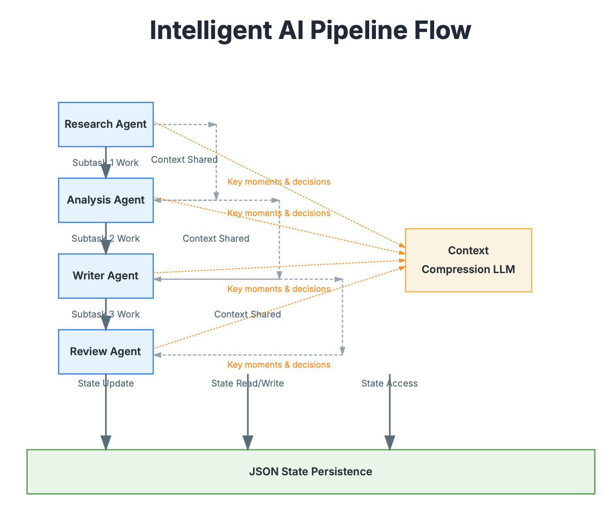
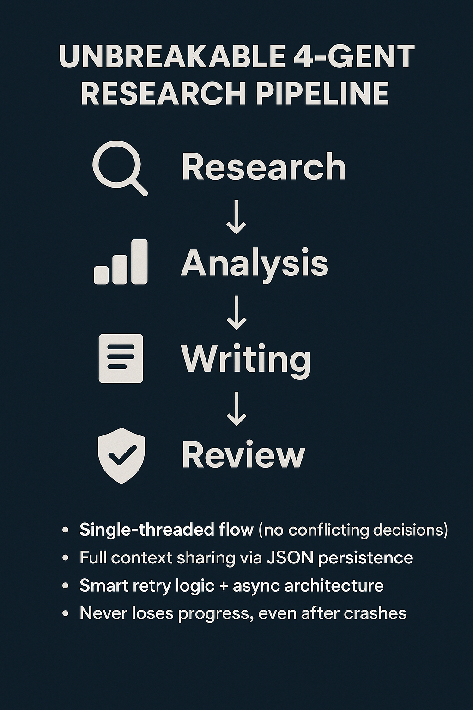
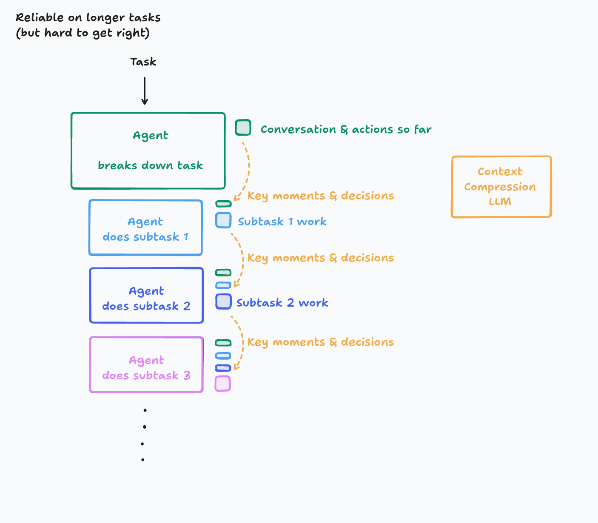

# Reliable Multi-Agent Research System

This project implements a robust, multi-agent system designed for long-running, complex tasks. It demonstrates key principles of context engineering and reliable system design, inspired by the concepts outlined in [Cognition AI's blog post on multi-agent systems](https://cognition.ai/blog/dont-build-multi-agents).

The system simulates a complete research-to-report workflow, where specialized agents collaborate to produce a comprehensive report on a given topic.



## 🚀 Key Features

- **State Management & Persistence**: The system tracks the state of every task in a `task_states.json` file. This allows the workflow to be paused, inspected, and resumed, even after a crash.
- **Error Handling & Automatic Retries**: Failed tasks are automatically retried with an exponential backoff strategy, making the system resilient to transient errors (e.g., network issues, temporary API failures).
- **Dependency Management**: A central `CoordinatorAgent` ensures that tasks are executed only after their dependencies are successfully completed.
- **Asynchronous Architecture**: Built with Python's `asyncio` to handle concurrent tasks efficiently, especially I/O-bound operations like API calls.
- **Agent Specialization**: Each agent has a single, well-defined responsibility, promoting modularity and maintainability.
- **Structured Data Flow**: Uses Pydantic models to enforce a strict schema for the data passed between agents, reducing runtime errors.
- **Formatted Output**: Generates a clean, human-readable final report (`research_results.txt`) summarizing the entire workflow.

## ⚙️ The Workflow



The system orchestrates a four-step workflow, managed by a central coordinator:

1.  **🔍 Research Agent**

    - **Input**: A topic.
    - **Action**: Gathers initial information, key findings, sources, and recommendations.
    - **Output**: A structured `ResearchResult`.

2.  **📊 Analyzer Agent**

    - **Input**: The `ResearchResult` from the previous step.
    - **Action**: Analyzes the research data to identify trends, insights, opportunities, and risks.
    - **Output**: A structured `AnalysisResult`.

3.  **✍️ Writer Agent**

    - **Input**: Both `ResearchResult` and `AnalysisResult`.
    - **Action**: Synthesizes the information into a comprehensive, well-structured report.
    - **Output**: A structured `ContentResult`.

4.  **✅ Reviewer Agent**
    - **Input**: The `ContentResult` (the final report).
    - **Action**: Evaluates the report against a set of criteria, providing a score, feedback, and an approval status.
    - **Output**: A structured `ReviewResult`.

This entire process is coordinated to ensure a smooth flow of data and robust handling of any potential failures.

## 🛠️ Getting Started

Follow these steps to get the project running on your local machine.

### 1. Prerequisites

- Python 3.8+
- An OpenAI API key

### 2. Installation

1.  **Clone the repository:**

    ```sh
    git clone https://github.com/jiten0709/Artificial-Intelligence.git
    cd Artificial-Intelligence
    ```

2.  **Create a virtual environment (recommended):**

    ```sh
    python3 -m venv venv
    source venv/bin/activate  # On Windows, use `venv\Scripts\activate`
    ```

3.  **Install dependencies:**

    Run the installation command:

    ```sh
    cd AI-Agents/Cognition-Building-Multi-agents
    pip install -r requirements.txt
    ```

### 3. Configuration

1.  Create a file named `.env` and refer `.env.example`.
2.  Add your OpenAI API key to the `.env` file:

## ▶️ How to Run

Execute the script from your terminal:

```sh
python 1-multi-agent.py
```

The script will start the workflow, and you will see logs in the console detailing each agent's progress.

## 📄 Output Files

Upon successful execution, the script will generate two files in the same directory:

1.  **`task_states.json`**: A JSON file containing the detailed state of every task in the workflow. This file is updated in real-time and is used for persistence and recovery.
2.  **`research_results.txt`**: A well-formatted text file containing the final, human-readable report generated by the multi-agent system.

---

_This project serves as a practical example of building reliable and observable AI systems._

## 📚 References

- [Cognition AI Blog on Multi-Agent Systems](https://cognition.ai/blog/dont-build-multi-agents)



## ~ By Jiten 🥰
